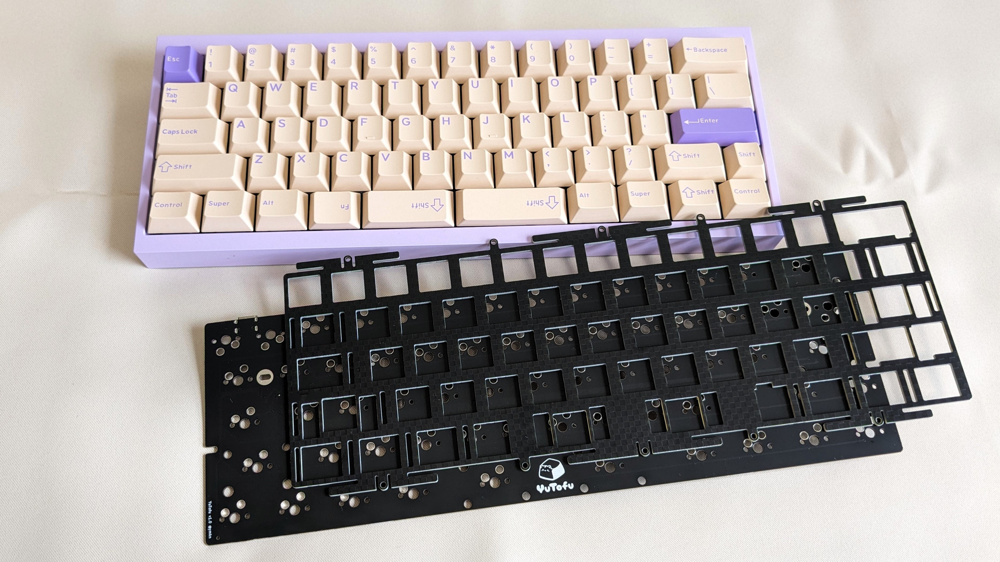
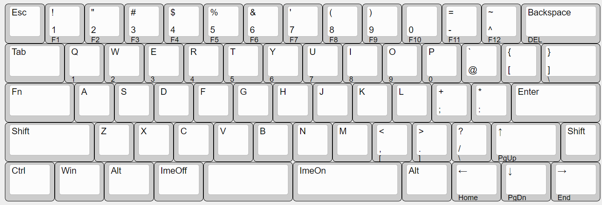

# YuTofu

YuTofu is an unofficial compatible PCB for the well-known custom keyboard [Tofu60 2.0](https://kbdfans.com/products/tofu60-2-0).

Based on an ANSI layout with splitted right-Shift and 6.25u spacebar, the spacebar area has been divided into 1.25u, 2.25u, and 2.75u sections. This allows for more effective use of the thumbs.

YuTofu is equipped with a 4-pin JSF socket compatible with [Unified Daughterboard](https://github.com/Unified-Daughterboard), in addition to an onboard USB Type-C connector and mounting holes compatible with the GH60-compatible layout. This means that the PCB can be used not only in the Tofu60 2.0 case but also in common GH60-compatible cases, i.e. [Tofu60 Redux Case](https://kbdfans.com/products/tofu60-redux-case).

## Default Layout

You can customize the layout with [Vial](https://get.vial.today/) configurator.

## Specification

- Hot swappable sockets for MX compatible switches
- Unified-Daughterboard JSF 4-pin socket or USB Type C Connector (USB 2.0)
- GH60 compatible dimension: 285mm(w) x 94.6mm(h) x 1.6mm(d)
- Suitable for most 60% keyboard cases
  - Warning: center and right bottom mounting holes are not implemented.

## Build Guide

See [doc/buildguide.md](doc/buildguide.md)

## LICENSE

This project is licensed under the MIT License, see the [LICENSE file](LICENSE) for details.
