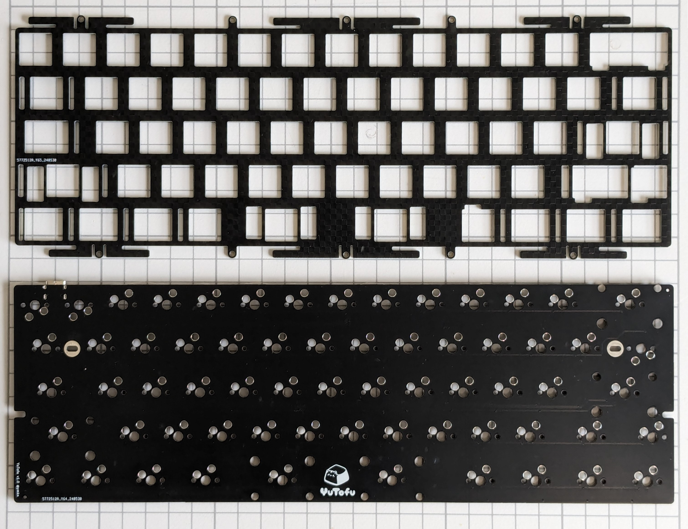
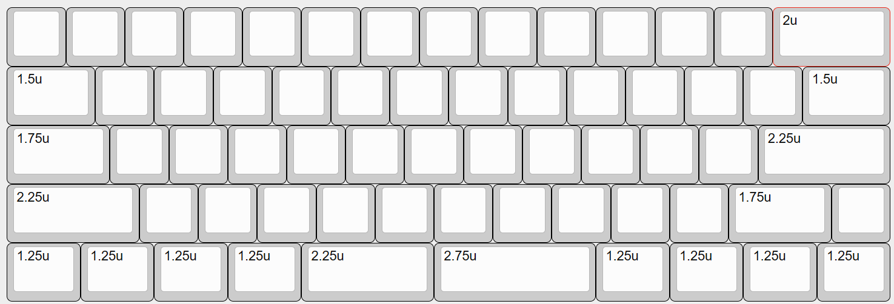
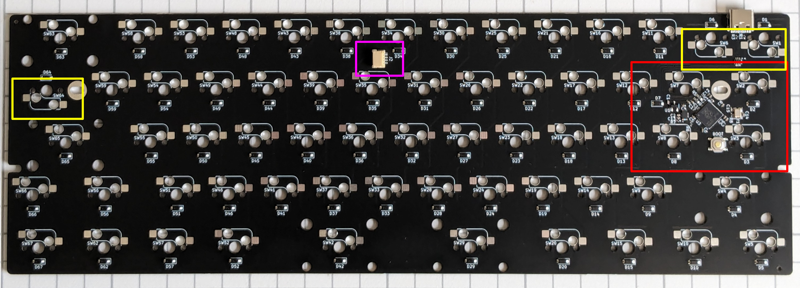
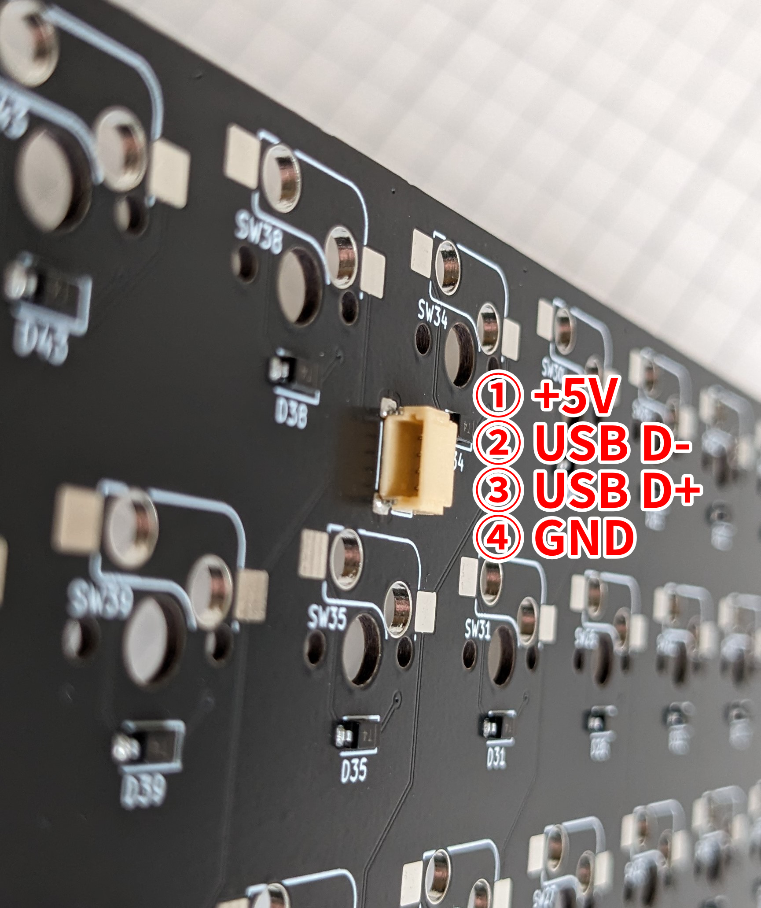

# YuTofu ビルドガイド

## 1. はじめに

本書は[Tofu60 2.0](https://kbdfans.com/products/tofu60-2-0)互換の自作キーボード基板であるYuTofuのビルドガイドです。Tofu60 2.0との組み合わせ利用以外は想定しておりませんのでご留意ください。

申し訳ないのですがYuTofu固有でない一般のご質問や、互換性確認済みケース以外についてのご質問にはお答えできません。各自お調べください。

> [!CAUTION]
> <em style="color: red; font-style: normal; font-weight: bold;">JSTコネクタとYuTofu基板上のUSBコネクタを同時にPCへ接続しないでください。YuTofuやPCの故障の危険性があります。</em>JSTコネクタ利用時はドーターボード側のUSBコネクタのみを使用し、YuTofu基板上のUSBコネクタを使用する場合はJSTコネクタに何も接続しないでください。

## 2. 準備

### 2.1 内容物確認

|品目|数量|
|---|---|
|YuTofu 基板|1|
|YuTofu スイッチプレート (Tofu60 2.0互換)|1|

### 2.2 別途用意が必要な部品

下記部品は国内外の自作キーボード専門店や電子部品販売店などから別途調達してください。

|品目|数量|備考|
|---|---|---|
|MX互換キースイッチ|64|[Cherry MX](https://www.cherrymx.de/en/dev.html)もしくはその互換品|
|MX互換スイッチソケット|64|[Kailh PCB Socket CPG151101S11](https://www.kailhswitch.com/mechanical-keyboard-switches/box-switches/mechanical-keyboard-switches-kailh-pcb-socket.html)もしくはその互換品|
|MX互換キーキャップ|-|[Cherry MX](https://www.cherrymx.de/en/dev.html)もしくはその互換品|
|2uサイズPCBマウント型スタビライザー|5|幅の広いキーの押し下げを安定させる部品です。Backspaceキー、左Shiftキー、Enterキー、2.25uスペース、2.75uスペースに用います|
|スタビライザー用シム (0.4mm厚)|2x5|スタビライザーの下に敷いて高さを調節するための部品です。YuTofu基板の厚みは1.2mmとなっているため、一般的な1.6mm基板用のスタビライザー1つごとに2つ必要になります。ただしスイッチフォームなど別の方法で高さを調整済みの場合は不要となります|
|Tofu60 2.0ケース|1|[Tofu60 2.0 Case](https://kbdfans.com/collections/case/products/tofu60-2-0-case)から、お好みのデザインのものを選択ください。似た名前の商品（Tofu65 2.0やTofu60 Redux等）がありますが、それらとは互換性がありませんので間違えないように注意してください。 PCBの外形寸法およびUSBコネクタ位置はGH60互換となっているため、その他のGH60互換ケースで使える可能性はありますが自己責任にてお願いいたします。|
|ドーターボード|1|Tofu60 2.0ケースには含まれないようです。[Tofu60 2.0 Accessories](https://kbdfans.com/collections/tofu60-2-0/products/tofu60-2-0-accessories)にあるDaughterboardが適合しますので入手してください。 このドーターボードは[Unified Daughterboard C series](https://unified-daughterboard.github.io/#/db-spec-c)互換と思われますので、同互換品が利用可能な可能性がありますが自己責任にてお願いします。|

#### 必要なキーキャップとサイズ

分割スペースキーを採用していますので、一般的なANSIキーキャップセットに加え、2.75uと2.25uサイズのスペースキーがそれぞれ1つずつ必要です。

右Shiftを分割するレイアウトを採用していますので、右Shiftキーは1.75uのものが必要です。

## 3. 組み立て

### 3.1 スイッチソケットのはんだ付け

スイッチソケットは基板の裏面（ICチップ等が実装されている面）に取り付けます。L字状のガイドが白線でキー数分印刷されていますので、そのすべてにスイッチソケットをはんだ付けします。

ICチップ近辺のソケット（■赤枠部分）をはんだ付けする際は、はんだごてで電子部品をを焼いてしまわないように気を付けてください。JSTコネクタ（■紫枠部分）も同様に注意ください。

すべてのスイッチソケットが基板に密着しており、ソケット両端とも漏れなくはんだ付けされているか確認してください。基板から浮いていたり、はんだ付けができていないとキースイッチの動作不良の原因になります。

> [!CAUTION]
> 最上段の右端2つ、2段目左端の3つだけ、スイッチソケットの向きが上下逆になっているので注意してください（■黄色枠部分）。

### 3.2 スタビライザーの取り付け

スタビライザーは基板の表面（ロゴが印刷されている面）に取り付けます。

Backspaceキー、左Shiftキー、Enterキー、スペースキー（2.25、2.75）に2uサイズのスタビライザーを取り付けます。取り付け方はスタビライザーごとに異なりますが、一般には大きい穴の方にツメを引っかけ、小さい穴の方にプッシュピンを差し込む、もしくはネジ留めを行います。

シムを用いる場合は基板とスタビライザーの間に挟むように設置してください。

### 3.3 スイッチの取り付け

キースイッチはトッププレートを通して基板のソケットに差し込みます。すべてのキースイッチを一度に取り付けてしまうと基板に差し込むのが大変なので、まずトッププレートの四隅にキースイッチを取り付けて基板に差し込み、その後残りのスイッチを取り付けていくのがおすすめです。

### 3.4 ケースへの取り付け

Tofu60 2.0ケースへの取り付けはTofu60 2.0公式の[チュートリアル](https://www.notion.so/Tofu60-2-0-Building-tutorial-En-9c9b5f84711a4535b2f4f092510302da)や[ビルドビデオ](https://www.youtube.com/watch?v=rxgFLHTjNlE)を参照してください。

> [!CAUTION]
> <em style="color: red; font-style: normal; font-weight: bold;">JSTコネクタとYuTofu基板上のUSBコネクタを同時にPCへ接続しないでください。YuTofuやPCの故障の危険性があります。</em>JSTコネクタ利用時はドーターボード側のUSBコネクタのみを使用し、YuTofu基板上のUSBコネクタを使用する場合はJSTコネクタに何も接続しないでください。

> [!NOTE]
> JSTコネクタのピンアサイン、端子の向きはTofu60 2.0と同じです。
> 
> 

基板をケースに取り付けられれば完成です！

## 4. 使用

## 4.1 コンピュータとの接続

お使いのコンピュータのUSB 2.0に対応したUSBコネクタと接続してください。即時利用できるはずです。

## 4.2 キーマップのカスタマイズ

本キーボードは[Vial](https://get.vial.today/)というキーマップ変更ツールに対応しています。Vialの詳しい使いかたはVialのドキュメントや世間の情報を参考にしてください。

## 5. その他

### 5.1 ブートモードの入り方

RP2040のブートモードに入るには、左上のキー（Escキー）を押しながらUSBケーブルを接続します。

もしくは、基板裏面のBOOTスイッチを押しながらUSBケーブルを接続します。

### 5.2 ファームウェアのありか

本リポジトリ内で公開しています。

https://github.com/ymkn/YuTofu/blob/main/firmware/QMK/ymkn_yutofu_vial.uf2

### 5.3 ソースコード/設計データのありか

本リポジトリ内で公開しています。MITライセンスです。

https://github.com/ymkn/YuTofu
